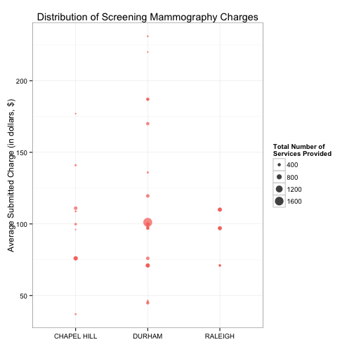

## Background

1. Federal government is taking steps to make healthcare system more transparent and accountable  
2. The Medicare provider utilization and payment data was released in June 2014 at the annual Health Datapalooza conference in Washington D.C.  
3. Contains information on Medicare fee-for-service beneficiaries  
4. Can be accessed [here](http://www.cms.gov/Research-Statistics-Data-and-Systems/Statistics-Trends-and-Reports/Medicare-Provider-Charge-Data/Physician-and-Other-Supplier.html)  

--- .class #id 

## Why the triangle region of North Carolina?
* This is where I study healthcare and healthcare policy  
* There is a major health system in each of the three cities in the triangle:  
 + Duke University Health System in Durham, NC  
 + UNC Health Care in Chapel Hill, NC  
 + WakeMed in Raleigh, NC  
* Duke and UNC compete fiercely over everything (not just healthcare services)  
* The [Dartmouth Atlas](http://www.dartmouthatlas.org/data/topic/topic.aspx?cat=21) has been documenting for years the variation across the country, but I wanted to look more closely in my local region  

--- .class #id 

## Data structure
### Full data set  
* 9 million rows  
* Each row corresponds to a procedure performed by a specific provider

```
##   Provider_Name nppes_provider_city place_of_service hcpcs_code
## 1 HALL, WILLIAM             RALEIGH     Non-facility      99203
##                  hcpcs_description line_srvc_cnt
## 1 Outpatient visit for new patient            26
##   average_submitted_chrg_amt average_Medicare_payment_amt
## 1                      210.6                        79.94
```
### Subset of interest  
* Individual providers in the Triangle region of North Carolina (Raleigh, Durham, and Chapell Hill)  
* Eight common procedures  
* Medicare charges  

--- .class #id

## Interactive web app  
* Select a procedure (e.g., Screening Mammogram) and a provider setting (e.g., Facility)  
 
